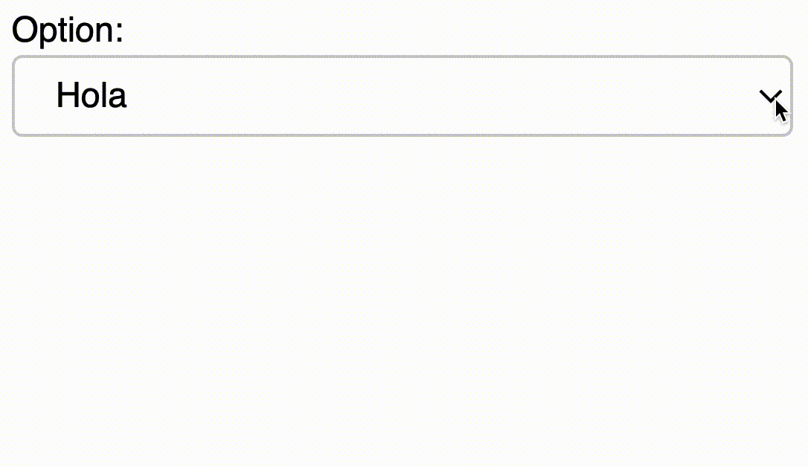
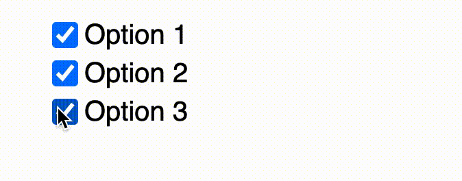
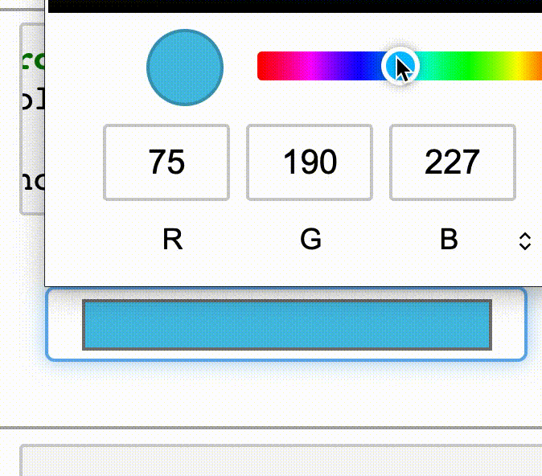

# 5.8 Build an application

## 1.Widgets

Widgets are interactive controls that can be added to Bokeh applications to provide a front end user interface to a visualization. They can drive new computations, update plots, and connect to other programmatic functionality. 

Widgets can also be used without the Bokeh server in standalone HTML documents through the browser’s Javascript runtime.

### Button

```text
from bokeh.layouts import column  # to grid plot graphs 
from bokeh.models import Button

button1 = Button(label="Success", button_type="success")
button2 = Button(label="Primary", button_type="primary")
button3 = Button(label="Warning", button_type="warning")
show(column(button1,button2,button3))
```


### Select

```text
from bokeh.models import Select

select = Select(title="Option:", value="hi", options=["hello", "Hola", "Hâllo"])
show(select)
```



### Checkbox

```text
from bokeh.models import CheckboxGroup
checkbox_group = CheckboxGroup(
        labels=["Option 1", "Option 2", "Option 3"], active=[0, 1])

show(checkbox_group)
```




### Color Picker

```text
from bokeh.models import ColorPicker
color_picker = ColorPicker(color="#4BBEE3", title="Choose color:", width=200)

show(color_picker)
```




### RadioButton

```text
from bokeh.models import RadioButtonGroup

radio_button_group = RadioButtonGroup(
        labels=["Option 1", "Option 2", "Option 3"], active=0)

show(radio_button_group)
```


## Build a simple application

