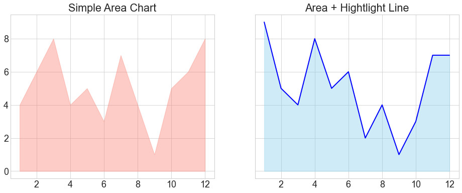

# 3.3 Area Chart

An **area chart** or area graph displays graphically quantitative data. It is based on the line chart. The area between axis and line are commonly emphasized with colors, textures, and hatchings.

### 1. Area Chart and Highlight  Line

First,  let us create a simple dataset and customize the figure set.

```text
x = range(1,13)
y1 = [4,6,8,4,5,3,7,4,1,5,6,8]
y2 = [9,5,4,8,5,6,2,4,1,3,7,7]

# customize setting
plt.style.use('seaborn-whitegrid')
plt.rcParams.update({'font.size': 18})
```

Then, Here are two examples. One is a simple area chart, the other is an area chart with a highlight line.

```text
fig,(ax1,ax2) = plt.subplots(1,2,sharey=True, figsize= (16,6))

ax1.fill_between(x,y1,color= 'salmon',alpha = 0.4)
ax1.set_title('Simple Area Chart')   #  set title of  ax1

ax2.fill_between(x,y2,color= 'skyblue',alpha = 0.4)   #  create area  chart
ax2.plot(x, y2, color="blue",linewidth = 2)   # create highlight line
ax2.set_title('Area + Hightlight Line')

```



#### Example  2

Suppose You want to know the sales performance of your two kinds of goods in one year. As they share the same period,  it's better to overlap the two sales performance together.

```text
plt.style.use('seaborn-white')  # let  us try another style
plt.figure(figsize= (12,6))     # set the figure size
```

```text
plt.fill_between(x,y1,color= 'salmon',alpha = 0.5,label = 'Salmon')
plt.fill_between(x,y2,color= 'skyblue',alpha = 0.8,label = 'Tuna')
plt.xlabel('Month')
plt.ylabel('Sales')
plt.legend()
```


### 2. Stacked Area Chart

If you want to represent an evolution for several groups in the same time, you are probably interested by **stacked area chart,** where every groups are displayed one of top of each other.

Let us create  a simple financial dataset.

```text
x = range(1,7)   #  the list x has  6 items, not 7
y3 =[ [10,12,14,18,18,16], [30,34,28,26,30,27], [5,6,6,6,4,4],[18,22,14,17,21,30] ]
```

```text
plt.stackplot(x,y3, labels=['Inventory','Sales','Credit','Cash'], alpha=0.7 )
plt.xlabel('Month')
plt.ylabel('Million/USD')

# Put a legend to the right of the current axis
plt.legend(loc='center left', bbox_to_anchor=(1, 0.5))
```


Although a stacked area chart may not be the best way to illustrate a financial report, we still can figure out that the company's financial situation in the last 6 months was very healthy. 


