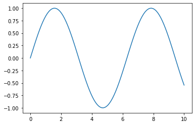

# 3.1 Basic Concepts

### 1.  Figure and Axes 

For all Matplotlib plots, we start by creating a figure and an axes. In their simplest form, a figure and axes can be created as follows:

```text
fig = plt.figure()
ax = plt.axes()
```


For better understanding **axes**, here is an example, we can plot several axes in one figure

```text
fig = plt.figure(figsize  = (12,6))   # create a figure and set figure size
ax1= plt.axes()                       # create the first axes
ax2 = plt.axes([0.5, 0.5, 0.3, 0.3])   # create the second axes   
ax3 = plt.axes([0.2,0.2,0.2,0.2])      # create the third axes
```


### 2. Oriented Object 

Matplotlib graphs your data on [`Figure`](https://matplotlib.org/api/_as_gen/matplotlib.figure.Figure.html#matplotlib.figure.Figure)s \(i.e., windows, Jupyter widgets, etc.\), each of which can contain one or more [`Axes`](https://matplotlib.org/api/axes_api.html#matplotlib.axes.Axes) \(i.e., an area where points can be specified in terms of x-y coordinates. It's called **object-oriented.**  In other words, ****you need to create objects.


```text
fig, ax = plt.subplots()  # Create a figure containing a single axes
x = np.linspace(0, 10, 100)
ax.plot(x, np.sin(x)) # plot a sine line on the axes
```




According to last chapter,   could you find the flaw of the chart?


### 3.  Pyplot 

There is a corresponding function in the [`matplotlib.pyplot`](https://matplotlib.org/api/_as_gen/matplotlib.pyplot.html#module-matplotlib.pyplot) module that performs that plot on the "current" axes, creating that axes \(and its parent figure\) if they don't exist. So the previous example can be written more shortly as

```text
plt.plot([1,2,3,4],[3,2,3,4])  # pyplot way
```

As noted above, there are essentially two ways to use Matplotlib:

* Explicitly create figures and axes, and call methods on them \(the "object-oriented \(OO\) style"\).
* Rely on pyplot to automatically create and manage the figures and axes, and use pyplot functions for plotting.


If you forget the elements of plot, find it ****[**here**](https://app.gitbook.com/@ivy-wang/s/crash-visulisation/~/drafts/-MBLFg0lOJc2yNX6jGoq/visualisation-in-python/matplotlib#parts-of-figure)



