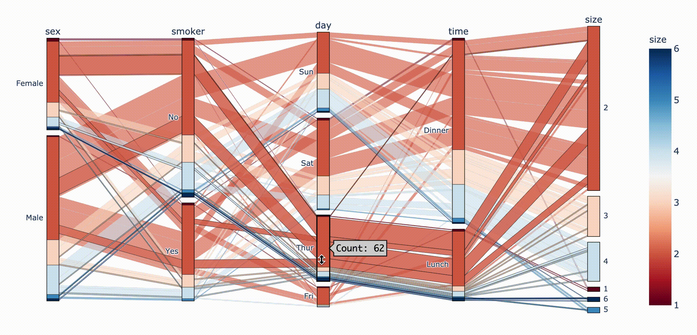
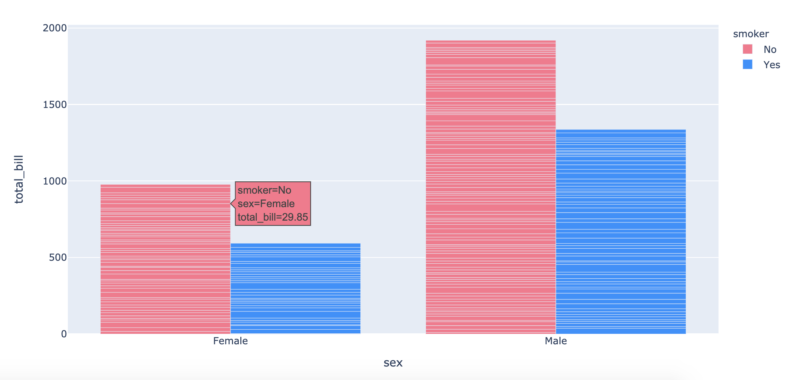
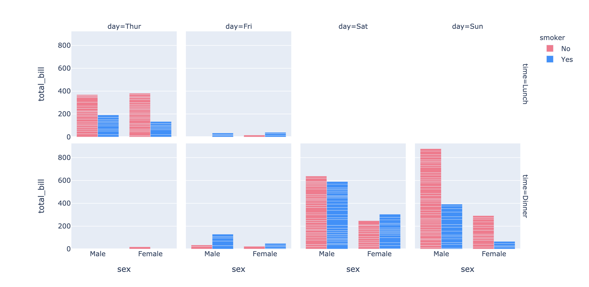
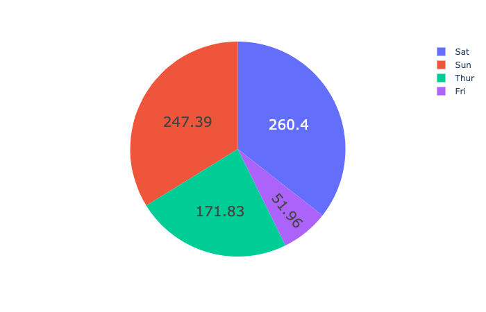
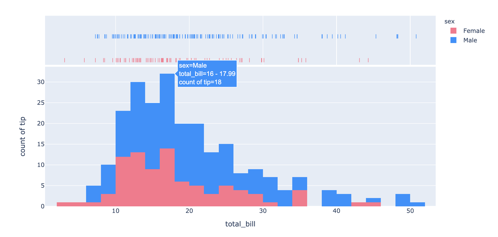
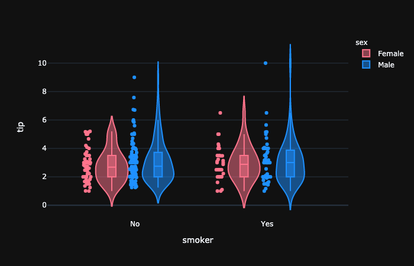
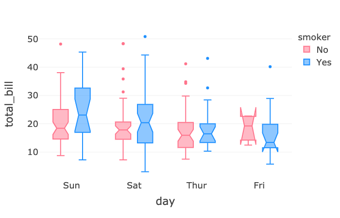

# 6.1.1 Plotly Express

> **Plotly** _describes_ **Plotly-express** _as a_ _**“terse, consistent, high-level API for rapid data exploration and figure generation”**_.

 **Plotly Express \(px\)** is a built-in part of the`plotly`library and is the recommended starting point for creating the most common figures. Every Plotly Express function uses [graph objects ](6.1.2-plotly-graph-objects.md)internally and returns a figure instance.

Plotly Express provides more than 30 functions for creating different types of figures, from a scatter plot to a bar chart to a histogram to a sunburst chart throughout a data exploration session.


**Plotly Express currently includes the following functions:**

* **Basics**: `scatter`, `line`, `area`, `bar`, `funnel`, `timeline`
* **Part-of-Whole**: `pie`, `sunburst`, `treemap`, `funnel_area`
* **1D Distributions**: `histogram`, `box`, `violin`, `strip`
* **2D Distributions**: `density_heatmap`, `density_contour`
* **Matrix Input**: `imshow`
* **3-Dimensional**: `scatter_3d`, `line_3d`
* **Multidimensional**: `scatter_matrix`, `parallel_coordinates`, `parallel_categories`
* **Tile Maps**: `scatter_mapbox`, `line_mapbox`, `choropleth_mapbox`, `density_mapbox`
* **Outline Maps**: `scatter_geo`, `line_geo`, `choropleth`
* **Polar Charts**: `scatter_polar`, `line_polar`, `bar_polar`
* **Ternary Charts**: `scatter_ternary`, `line_ternary`


Let's still use the **tips** dataset  and **gapmind** dataset for example.

```text
import plotly.express as px
tips = px.data.tips()
```

### 1. Scatter and Line

```text
fig = px.scatter(tips, x="total_bill", y="tip",trendline="ols")
fig.show()
```

Here we can a strong positive correlation between **tip** and **total\_bill.** The higher the total bill, the higher the tip. But could we know more from one figure?


We can add more parameters to make the scatter chart informative. On the top lays the boxplot distribution, on the right lays the violin plot distribution. Meanwhile, we distinguished each day's performance.

```text
fig = px.scatter(tips, x="total_bill", y="tip", color="day", marginal_y="violin",
           marginal_x="box", trendline="ols")
fig.show()
```


We also can consider using a **parallel chart** to illustrate the relationship. It compares the feature of several individual observations on a set of numeric variables. Each vertical bar represents a variable and often has its own scale. Values are then plotted as a series of lines connected across each axis. 

```text
fig = px.parallel_categories(df, color="size", 
                color_continuous_scale=px.colors.sequential.RdBu )
fig.show()
```



### 2. Bar Chart

The scatter chart and line chart are not always the best way to display comparison. In this case,  a bar chart is more appropriate. As we mentioned in chapter 3,  the bar chart family includes **grouped bar, stacked bar, and facet bar chart.**

**Grouped Bar**

```text
fig = px.bar(tips, x="sex", y="total_bill", color="smoker", 
                barmode="group",color_discrete_sequence =['#ff748c','#1e90ff'])
fig.show()
```



\*\*\*\*

**Stacked Bar**  

```text
# without "barmode" parameter
fig = px.bar(tips, x="sex", y="total_bill", color="smoker",
                color_discrete_sequence =['#ff748c','#1e90ff'])
fig.show()
```


**Facet Barplot**

Compared to the above, the facet barplot has the best performance to illustrate the relationship between multiple variables.

```text
fig = px.bar(tips, x="sex", y="total_bill", color="smoker", barmode="group",
              facet_row="time", facet_col="day",
              category_orders={"day": ["Thur", "Fri", "Sat", "Sun"], 
                            "time": ["Lunch", "Dinner"]} ,
              color_discrete_sequence =['#ff748c','#1e90ff'])
fig.show()
```



### 3. Pie Chart

`plotly.express` has a shorter way to create a fancy pie chart than `matplotlib` and  `seaborn`.

```text
df = px.data.tips()
fig = px.pie(df, values='tip', names='day')
fig.update_traces(textinfo='value', textfont_size=20)
fig.show()
```



### 4. Distribution

As we discussed in chapter 3 and chapter 4, the distribution family contains a histogram plot, boxplot, and violin plot.


In the `plotly.express` **\(px\)**, we can set the quick style by the parameter "template".     Available templates:

```text
['ggplot2', 'seaborn', 'simple_white', 'plotly',
'plotly_white', 'plotly_dark', 'presentation', 'xgridoff',
'ygridoff', 'gridon', 'none']
```

*  The histogram plot uses the default template
* The violin plot uses the 'plotly\_dark' template
* The boxplot uses the 'presentation' template, the font is bigger than others.


**Histogram plot**

```text
fig = px.histogram(tips, x="total_bill", y="tip", color="sex", 
                   marginal="rug", hover_data=tips.columns
                   ,color_discrete_sequence =['#ff748c','#1e90ff'])
fig.show()

```



**Violin plot**

```text
fig = px.violin(tips, y="tip", x="smoker", color="sex", box=True, points="all", 
              hover_data=tips.columns, color_discrete_sequence =['#ff748c','#1e90ff'], 
              template= 'plotly_dark')
fig.show()
```



**Box plot**

```text
fig = px.box(tips, x="day", y="total_bill", color="smoker", notched=True,
            color_discrete_sequence =['#ff748c','#1e90ff'],template = 'presentation')
fig.show()
```



