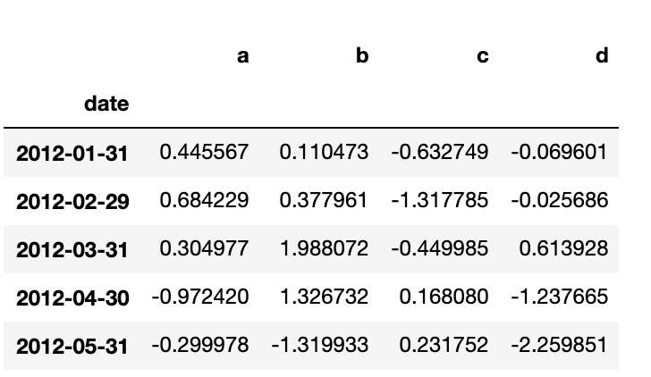
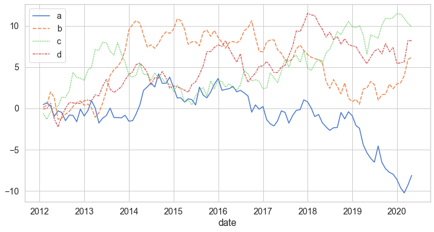
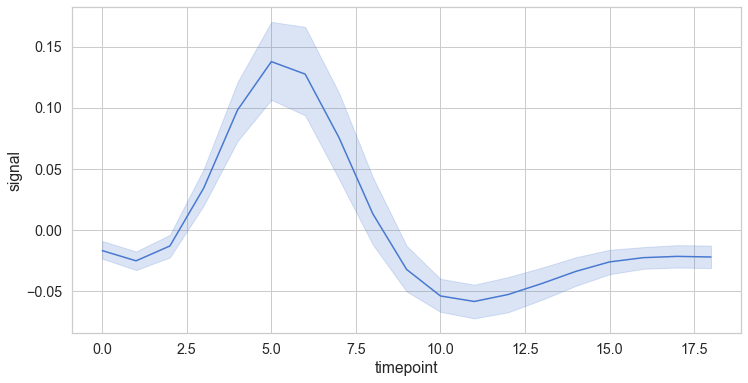
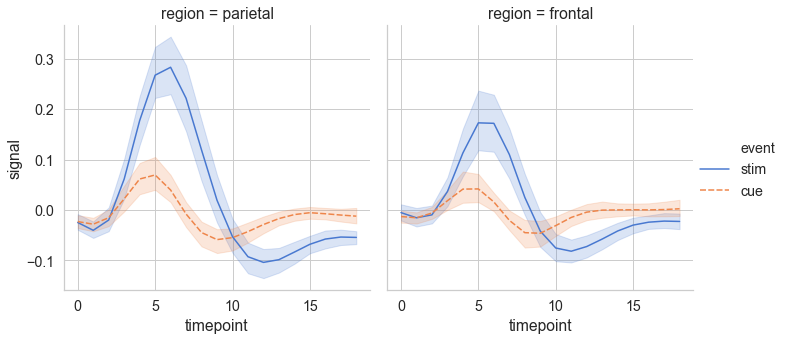

# 4.1.1. Line plot

### Quick start

```text
import pandas as pd
import numpy as np
import matplotlib.pyplot as plt

import seaborn as  sns
sns.set(rc={'figure.figsize':(12,6)},font_scale=1.3, 
        style = 'whitegrid',palette ='muted')
```


You can set aesthetic parameters in one step by **`sns.set()`**

* **font\_scale:** Separate scaling factor to independently scale the size of the font elements.
* **style:** dict, None, or one of {**darkgrid, whitegrid, dark, white, ticks**}
* **palette:** Color palette, see [`color_palette()`](https://seaborn.pydata.org/generated/seaborn.color_palette.html#seaborn.color_palette)


### Simple plot

Firstly, let us create a simple dataset. The head of the dataset looks as below:   

```text
# create a dataset
index = pd.date_range("1 1 2012", periods=100,
                      freq="m", name="date")
data = np.random.randn(100, 4).cumsum(axis=0)
df = pd.DataFrame(data, index, ["a", "b", "c", "d"])
```



Then, we can plot a very simple line chart. Since we've already set all the aesthetic parameters at the beginning, here the code is pretty short and clean.

```text
sns.lineplot(data=df)
```



We can not only plot a full dataset, but also pieces of the dataset. For example, I will truncate two lists of data from the original dataset. One is in different period, the other is in the same period. Then we put them together by `plt.subplots()`

* a and b are different lines in different peirod.
* c and c are different lines in same period. 

```text
list1 = [df.loc[:"2015", "a"], df.loc["2015":, "b"]]
list2 = [df.loc[:"2015", "c"], df.loc[:"2015", "d"]]

f,axes  = plt.subplots(2,1)      # create a subplot, 2 row and 1 column  
sns.lineplot(data=list1, ax=axes[0])   # plot list 1  
sns.lineplot(data=list2, ax=axes[1])   # plot list 2
```


### Smart plot

More complex datasets will have multiple measurements for the same value of the x variable. The default behavior in seaborn is to aggregate the multiple measurements at each x value by **plotting the mean and the 95% confidence interval** \( grey area\) around the mean. Let us take the "[fmri](https://github.com/mwaskom/seaborn-data/blob/master/fmri.csv)" dataset for example.

```text
fmri = sns.load_dataset("fmri")                 # import embedded dataset 
sns.lineplot(x="timepoint", y="signal",  data=fmri)        # line plot
```



The relationship between `x` and `y` can be shown for different subsets of the data using the `hue`, `size`, and `style` parameters. These parameters control what visual semantics are used to identify the different subsets. 


* **hue:** Grouping variable that will produce lines with different colors. Can be either categorical or numeric, although color mapping will behave differently in latter case.
* **size:** Grouping variable that will produce lines with different widths. Can be either categorical or numeric, although size mapping will behave differently in latter case.
* **style:** Grouping variable that will produce lines with different dashes and/or markers. Can have a numeric dtype but will always be treated as categorical.


For example, seaborn groups variables in the "fmri" dataset and show the groups with different colors, and use color and line dashing to represent two different grouping variables.

```text
# Plot the responses for different events and regions
sns.lineplot(x="timepoint", y="signal", data=fmri
             hue="region", style = "event")
```


### Facet plot

The chart above is quite complicated and not user-friendly. People need to read slowly and carefully to get the information. In this case, we need to consider a smart way to deliver same information but more clear.

[`FacetGrid`](https://seaborn.pydata.org/generated/seaborn.FacetGrid.html#seaborn.FacetGrid)is a useful approach is to draw multiple instances of the same plot on different subsets of  dataset. It allows a viewer to quickly extract a large amount of information about complex data.

We can Use [`relplot()`](https://seaborn.pydata.org/generated/seaborn.relplot.html#seaborn.relplot) to combine [`lineplot()`](https://seaborn.pydata.org/generated/seaborn.lineplot.html#seaborn.lineplot) and [`FacetGrid`](https://seaborn.pydata.org/generated/seaborn.FacetGrid.html#seaborn.FacetGrid)

```text
sns.relplot(x="timepoint", y="signal", data=fmri
                 col="region", hue="event", style="event", kind="line")
```



