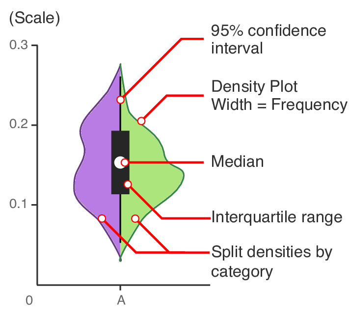

# 4.5.2 Violin plot

A violin plot is a method of plotting numeric data. It is similar to a box plot, with the addition of a rotated kernel density plot on each side. Violin plots are similar to box plots, except that they also show the probability density of the data at different values, usually smoothed by a kernel density estimator.

However, the violin plots can be harder to read and it not commonly used in professional settings.



Let's use the "mpg" and "tips" datasets for example.

```text
import seaborn as sns
plt.style.use('seaborn-white')
plt.rcParams.update({'font.size': 18,'figure.figsize':(12, 6)})

mpg = sns.load_dataset('mpg')
tips = sns.load_dataset('tips')
```

### Basic violin plot

```text
sns.violinplot(x='origin', y='horsepower', data=mpg, 
                scale='width', inner='quartile',palette = 'husl')

```

This violin plot shows the relationship of feed type to chick weight. The box plot elements show the median weight for horsebean-fed chicks is lower than for other feed types. The shape of the distribution \(extremely skinny on each end and wide in the middle\) indicates the weights of sunflower-fed chicks are highly concentrated around the median.


### Horizontal violin plot

Like horizontal bar charts, horizontal violin plots are ideal for dealing with many categories. Swapping axes gives the category labels more room to breathe.

```text
# very straightforward, just change the 'x' and 'y'
sns.violinplot(y='origin', x='mpg', data=mpg, 
                scale='width', inner='quartile',palette = 'husl')
```


### Grouped violin plot

Violin plots can also illustrate a second-order categorical variable. You can create groups within each category.

```text
# add a 'hue' parameter to differentiate
sns.violinplot(x='cylinders', y='horsepower', hue = 'origin', data=mpg, 
                scale='width', inner='quartile',palette = 'husl')
```


### Grouped violin plot with split violins

```text
tips = sns.load_dataset('tips')
```

**Example 1**

```text
sns.violinplot(x='size', y='total_bill', hue = 'time', data=tips,
        split = True, palette={"Dinner": "dodgerblue", "Lunch": "salmon"})
        
# Put the legend out of the figure
plt.legend(bbox_to_anchor=(1.05, 1), loc=2, borderaxespad=0.)
```


**Example 2**

```text
sns.violinplot(x='day', y='tip', hue = 'sex', data=tips,split = True, 
                palette={"Male": "dodgerblue", "Female": "salmon"})
```


