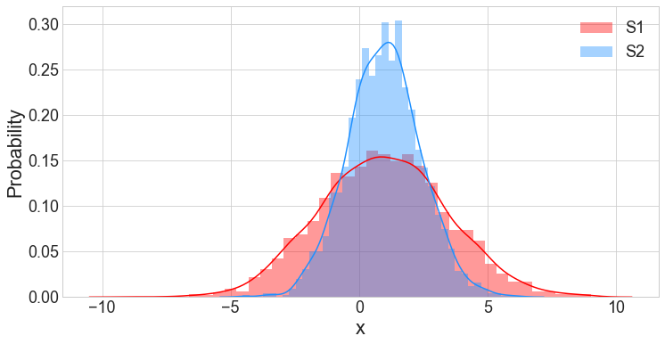

# 4.5.3 Histogram plot

When dealing with a set of data, often the first thing you’ll want to do is get a sense of how the variables are distributed.

### 1. Basic Histogram

The most convenient way to take a quick look at a univariate distribution in seaborn is  `distplot()`. By default, this will draw a [histogram](https://en.wikipedia.org/wiki/Histogram) and fit a [kernel density estimate](https://en.wikipedia.org/wiki/Kernel_density_estimation) \(KDE\).



```text
# Create a simple dataset
d = np.random.multivariate_normal([1, 1], [[6, 2], [2, 2]], size=3000)
df = pd.DataFrame(d, columns=['S1', 'S2'])
```

### 2. Univariate Distribution

```text
sns.distplot(df['S1'])
plt.xlabel('x')
```


Histograms are likely familiar, and a `hist` function already exists in `matplotlib`. A histogram represents the distribution of data by forming **bins** along with the range of the data and then drawing bars to show the number of observations that fall in each bin. We can try more or fewer bins that may reveal other features in the data.

```text
f,axes = plt.subplots(1,2,figsize = (16,6))
sns.distplot(df['S1'], bins=20, kde=False, rug=True,ax = axes[0],color = 'dodgerblue')
axes[0].set_title('Bins: 20')

sns.distplot(df['S1'], bins=200, kde=False, rug=True,ax = axes[1],color = 'dodgerblue')
axes[1].set_title('Bins: 200')
```


### 3. Multivariate Distribution

```text
sns.distplot(df['S1'],color = 'r',label = 'S1')
sns.distplot(df['S2'],color = 'dodgerblue', label = 'S2')

plt.xlabel('x')
plt.ylabel('Probability')
plt.legend()
```



### 4. Vertical Distribution

It is quite straightforward to make a vertical histogram with seaborn, just add **`vertical=True`** .

```text
sns.distplot(df['S1'],color = 'r',label = 'S1',vertical=True)
sns.distplot(df['S2'],color = 'dodgerblue',label = 'S2',vertical=True)

plt.ylabel('x')
plt.xlabel('Probability')
plt.legend()
```


### 5. Two Dimensional Distribution

It is also possible to use the kernel density estimation procedure described above to visualize a bivariate distribution.

**Example 1**

```text
sns.kdeplot(df, color ='r', shade=True)
```


**Example 2**

```text
f, ax = plt.subplots(figsize=(6, 6))
sns.kdeplot(df.S1, df.S2, ax=ax)
sns.rugplot(df.S1, color="r", ax=ax)
sns.rugplot(df.S2, vertical=True, ax=ax)
```


