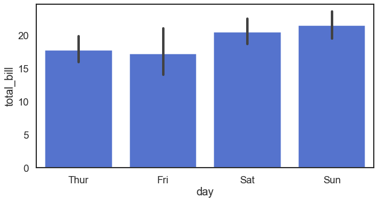
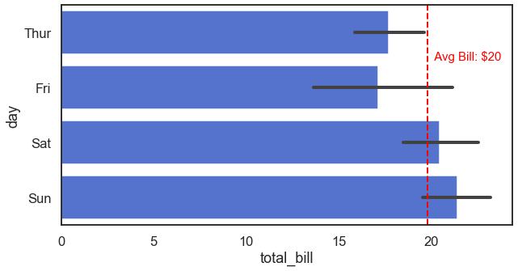
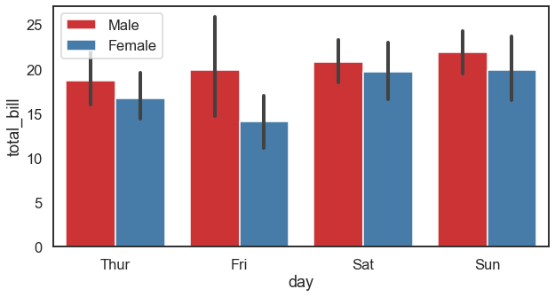

# 4.2.1 Barplot

A **barplot**  is one of the most common type of plot. It shows the relationship between a **numerical variable** and a **categorical variable**.

### 1. Simple Bar

```text
x = np.array(list("ABCDEFGHIJ"))  # categorical variable 
y = np.arange(1, 11)
sns.barplot(x=x, y=y, palette="viridis")  
```


### 2. Vertical barplot

```text
tips = sns.load_dataset("tips") # load embedded dataset "tips"

sns.barplot(x="day", y="total_bill", data=tips, color="royalblue")
```



### 3. Horizontal Barplot

```text
# make a horizontal barplot
sns.barplot(x="total_bill", y="day", data=tips, color="royalblue")

# add a vertical line
plt.axvline(x = 19.8,color='r',linewidth = 2,linestyle = '--')

# add annotation
plt.text(19.8+0.2, 0.5, " Avg Bill: $20", size='small', color='r', weight='light')
```



### 4. Grouped Barplot

```text
sns.barplot(x="day", y="total_bill", hue="sex", data=tips, palette = "Set1")
plt.legend(loc=2)  # set legend position 
```



### 5. Facet Barplot

```text
plt.figure(figsize = (12,6))
sns.catplot(x="sex", y="total_bill",
                hue="time", col="day",
                data=tips, kind="bar",
                height=5, aspect=.7,palette = "Set1");
```


