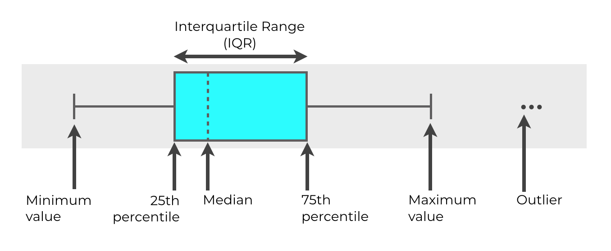

# 4.2.2 Boxplot

In descriptive statistics, a box plot or **boxplot** is a method for graphically depicting groups of numerical data through their quartiles. 

Box plot describes data distribution with 5 measures. Generally,  these five numbers illustrate a lot of information about the distribution of a variable.




**Interquartile range \(IQR\)**: 25th to 75th percentile


* **minimum** \(Q1 - 1.5 \* IQR\)
* **first quartile** \(Q1/ 25th percentile\), 
* **median** \(50th percentile\)
* **third quartile**\(Q3 / 75th percentile\) 
* **maximum.** \(Q1 + 1.5 \* IQR\)

```text
sns.set(style="ticks",font_scale=1.3 )
​sns.boxplot(x="day", y="total_bill", hue="smoker", palette=["b", "c"], data=tips)            sns.despine(offset=5, trim=True)plt.legend(bbox_to_anchor=(1.05, 1), loc=2)
```


```text
sns.boxenplot(x="day", y="total_bill", hue="time", palette=["b", "r"], data=tips)            
sns.despine(offset=10, trim=True)plt.legend(bbox_to_anchor=(1.05, 1), loc=2)
```


