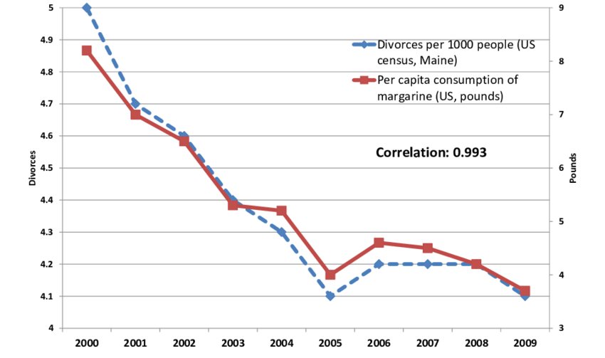
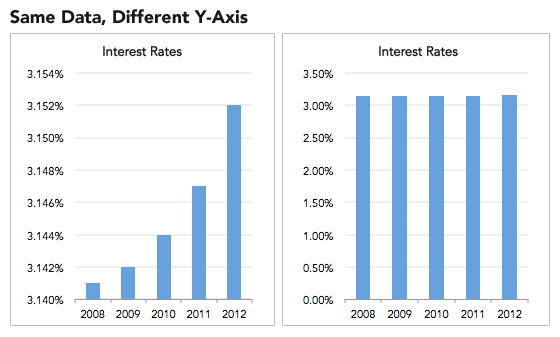
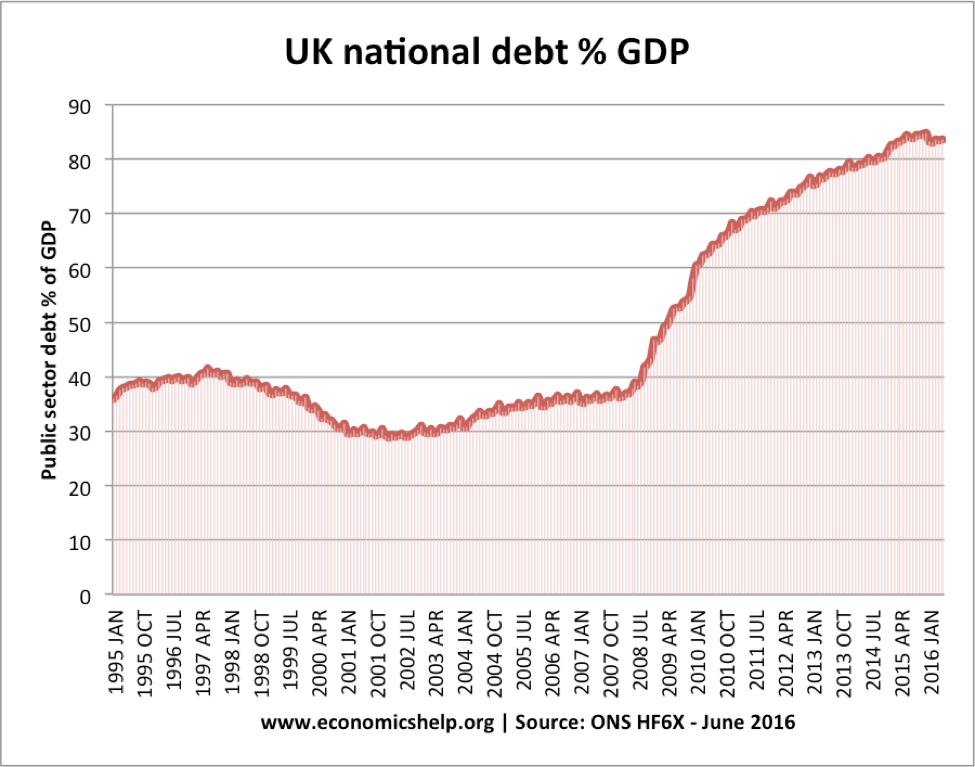
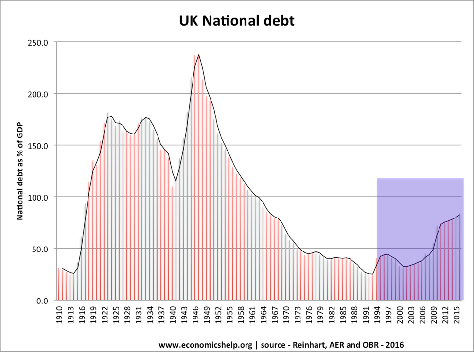
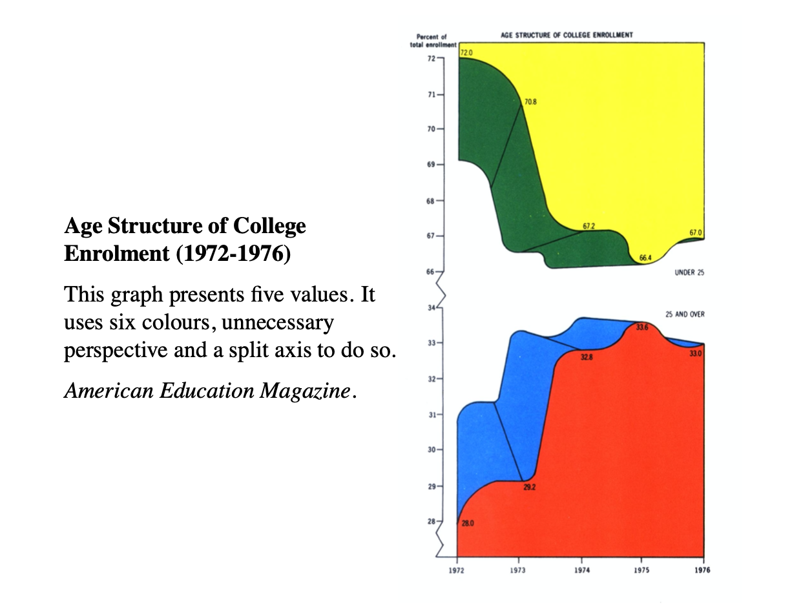
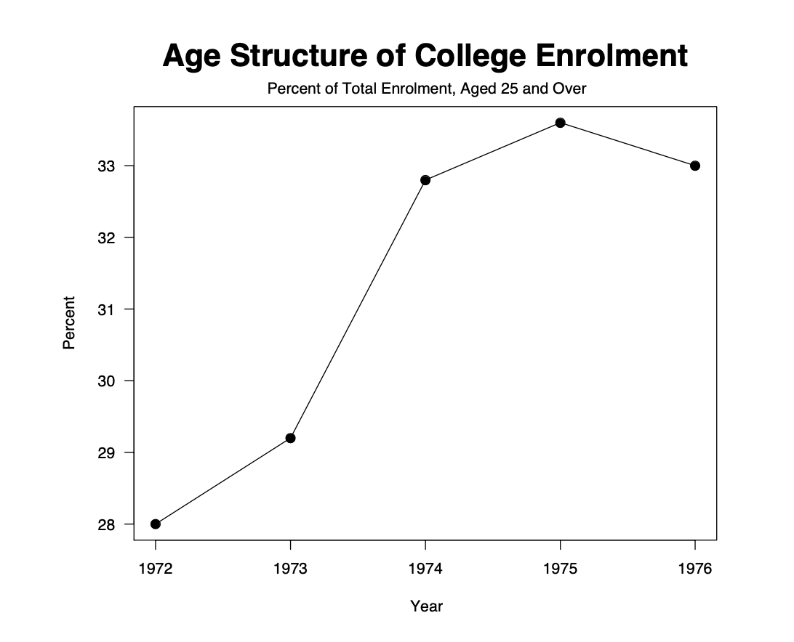
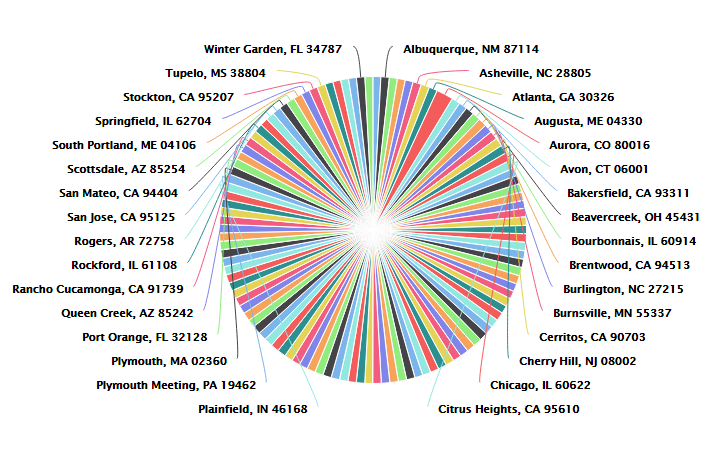

# 2.3 Misused Graph

Our brain is prewired to process visual content much quicker than text, which is why data design is so effective. By “seeing” the data, it is easier for your brain to intake, synthesize, and retain the information presented.

While graphs can be a valuable tool to help summarize data into a compelling story, they can also inadvertently be used incorrectly or worse, to mislead. It can make results appear different than they are and/or lead others to draw incorrect conclusions.  Here are a few typical tricks in visualization.

### 1. Irrelevant Data

Anyone who has taken an intro to psych or a statistics class has heard the adage, “[correlation does not imply causation](http://en.wikipedia.org/wiki/Correlation_does_not_imply_causation).” Just because two trends seem to fluctuate in tandem, these rule posits, that doesn’t prove that they are meaningfully related to one another. 

### 2. Misuse Graph

We know that pie charts are for slices which, together, make up 100%. If the numbers don’t add up to 100%, the pie chart has been misused. As you can see below, the percentages from each section add up to more than 100%, and it 's difficult to extract information at once. This is a common problem when people try to visualize survey data that has multiple answers.

### 3. Manipulate Axes

A common misleading feature in graphs is a skewed scale of axes.

#### Omit Baseline

In most cases,  the baseline for a graph is 0. But sometimes people can make it a different number to skew the graph. This misleading tactic is frequently used to make one group look better than another. It is known as a "**truncated graph**". 

For example, if you took a cursory glance at this graph you would probably think that the interest rate in 2012 is much higher than the rest. But a closer look shows that the interest rate is quite stable, only fluctuate between 3.140%  and 3.154%.

#### Manipulate X-Axis

A common trick of the graph manipulator is to blow out the scale of a graph to minimize or maximize a change. It is known as the [axis changing ](https://en.wikipedia.org/wiki/Misleading_graph#Axis_changes)in the data visualization world. Axis manipulation is almost the opposite of truncating data because they include the axis and baselines but change them so much that they lose meaning.

**Notice: The X-Axis of the left graph is not even.** 

#### Manipulate Y-Axis

Expanding or compressing the scale on a graph can make changes in data seem more or less significant than they are.

### 4. Manipulate Data

#### Missing Points

Something similar can be said about problems with the x-axis. When some data are missing,  it may tell a completely different story than when all of the data are presented.

#### Cherry-Picking Data

In the first graph below, a reader could obviously be misleading into thinking that the UK National debt has never been higher! This graph could be used to justify a politician voting on some piece of legislation that would lower the debt.

However, when you take a look at the full-time series, you can see that national debt is actually pretty low in comparison.

### 5. Complexity


* Graphs should be no more complex than the data that they portray.
* Unnecessary complexity can display **irrelevant decoration, color, 3D effects**.


It can be introduced in a simple and clear way.

### 6. Data Visualization Don’ts

#### Don’t intentionally misrepresent data

It’s important to mention. Whether done intentionally, or unintentionally, misrepresented data has consequences. For instance, any of the following errors can undermine the validity of your data set or even your reputation:


* An axis that starts at a place that exaggerates differences within the data
* Using uneven intervals between numbers
* Using inaccurate or inconsistent scales on size comparisons
* Using colors that are inappropriate for the data set being described
* [See more here](https://app.gitbook.com/@ivywang/s/crash-visulisation/~/drafts/-MC9E1ij1G2mNRhHh6Nt/tricks-in-visualisation/2.3-tricks-in-visualization#3-manipulate-axes)


#### Don’t try to present too much information

Squishing too much information into your visualization is confusing and just plain ugly. Here are a couple of signs that your visualization has too much information:


* There are more than six colors in your visual.
* The chart is crowded, and it is difficult, if not impossible, to differentiate between the data points within the first couple of seconds
* You need multiple text boxes to explain the data points.


#### Don’t try to make bad data look better

Bad data is bad data. No amount of creativity can produce a good graph from dubious data.

