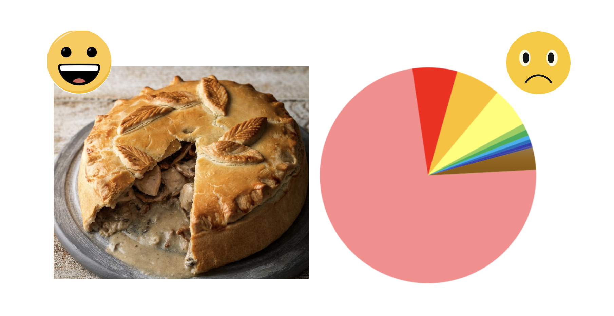
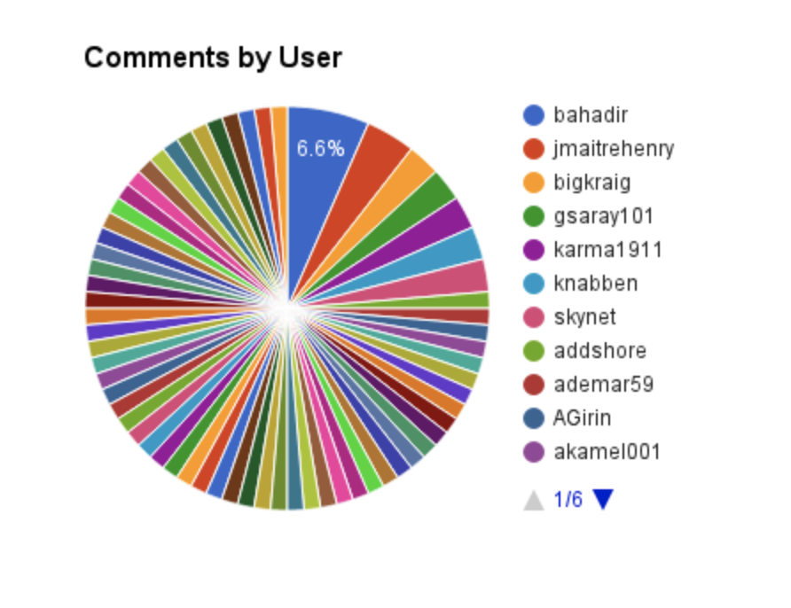
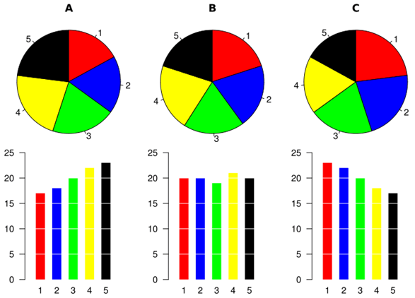

# 2.4 Pie Chart

Love pies and donuts in life, but  do not love it  in visualization. Unfortunately, these charts are among the most frequently used and also misused ones.

### Good Pie or Bad Pie?

**Pie charts are poor at communicating data.** They take up more space and are harder to read than the alternatives. The brain’s not very good at comparing the size of angles and because there’s no scale, reading accurate values is difficult. As you add more segments and colours, the problem gets worse. Labels can be hard to fit, especially to smaller segments, so often legends are required. 


Here is a good "bad pie" example.


Pie charts typically represent numbers in percentages, used to visualize a part to whole relationship or a composition. When possible, avoid pie charts and donuts. The human mind thinks linearly but, when it comes to angles and areas, most of us can’t judge them well.


Here is another good "bad pie" example.


 It's hard to read the precise value or percentage. Source: [Oracle.com](https://blogs.oracle.com/experience/entry/pie_charts_just_dont_work_when_comparing_data_-_number_10_of_top_10_reasons_to_never_ever_use_a_pie)

### What do we do?

Pie charts are very rarely the best choice for visualization,  same to the donut charts and stacked donut charts. I won't recommend using them. **Instead, we should use a table or column chart.** Both are way clearer than pie charts.

