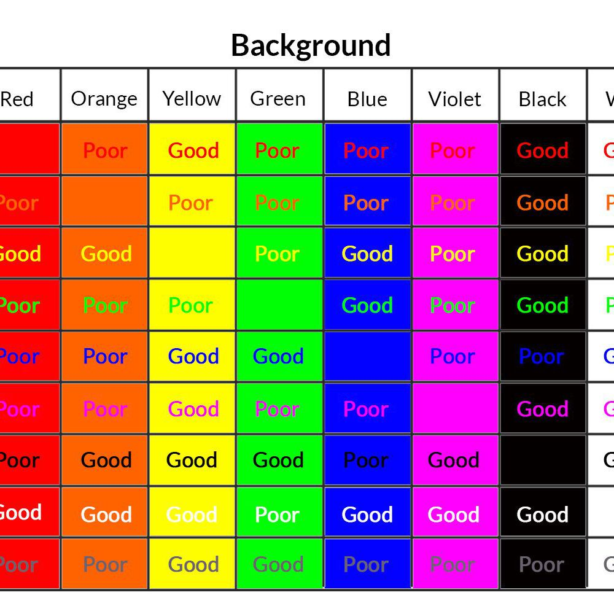
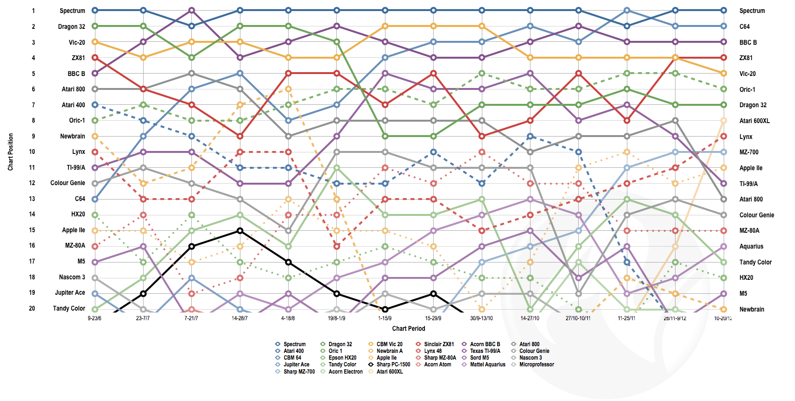

# 4. Do's and Don'ts in Visualization

### A General Conclusion

* **Time axis.** When using time in charts, set it on the horizontal axis. Time should run from left to right. Do not skip values \(time periods\), even if there are no values.
* **Proportional values.** The numbers in a chart \(displayed as bar, area, bubble, or other physically measured element in the chart\) should be directly proportional to the numerical quantities presented.
* **Data-Ink Ratio**. Remove any excess information, lines, colors, and text from a chart that does not add value. More about [data-Ink ratio](http://www.infovis-wiki.net/index.php/Data-Ink_Ratio)
* **Sorting.** For column and bar charts, to enable easier comparison, sort your data in ascending or descending order by the value, not alphabetically. This applies also to pie charts.
* **Legend**. You don’t need a legend if you have only one data category.
* **Labels**. Use labels directly on the line, column, bar, pie, etc., whenever possible, to avoid indirect look-up.
* **Inflation adjustment**. When using monetary values in a long-term series, make sure to adjust for inflation. \([EU Inflation rates](http://www.aboutinflation.com/inflation/european-union---inflation), [US InflationM rates](http://www.usinflationcalculator.com/inflation/historical-inflation-rates/)\)

* **Colors**. In any chart, don’t use more than six colors.
* **Colors**. For comparing the same value at different time periods, use the same color in a different intensity \(from light to dark\).
* **Colors**. For different categories, use different colors. The most widely used colors are black, white, red, green, blue, and yellow.
* **Colors**. Keep the same color palette or style for all charts in the series, and same axes and labels for similar charts to make your charts consistent and easy to compare.
* **Colors**. Check how your charts would look when printed out in grayscale. If you cannot distinguish color differences, you should change hue and saturation of colors.
* **Colors**. Seven to 10 percent of men have color deficiency. Keep that in mind when creating charts, ensuring they are readable for color-blind people.


Here is a way too complicated chart example


* **Data Complexity**. Don’t add too much information to a single chart. If necessary, split data in two charts, use highlighting, simplify colors, or change chart type. Source: [Junkcharts](http://junkcharts.typepad.com/junk_charts/2013/01/ruining-the-cake-with-too-much-icing.html)

